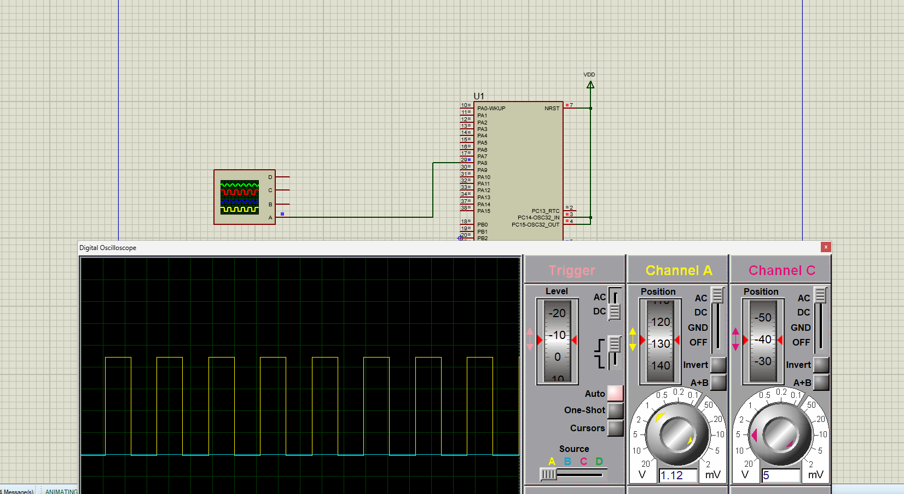
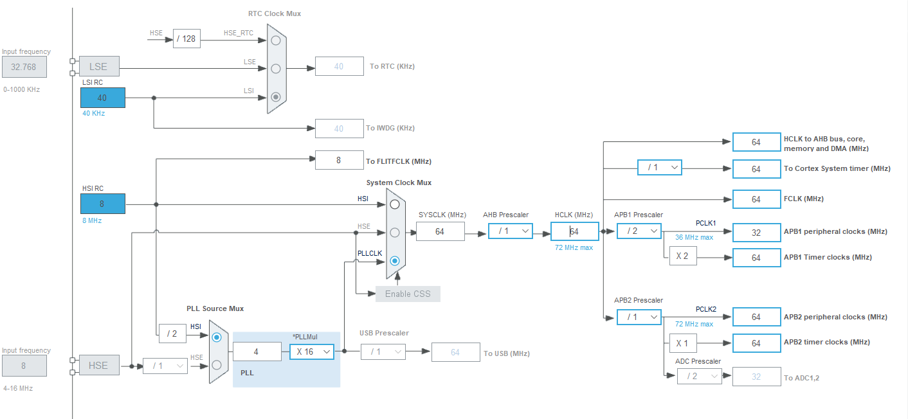
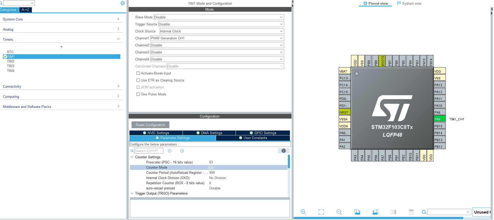

# STM32 Timer PWM



STM32F103C8Tx project demonstrating hardware PWM generation with
**TIM1 Channel 1**, configured with STM32CubeMX and implemented with
the STM32 HAL library.

The PWM signal is generated on pin **PA8 / TIM1_CH1** and verified
through a Proteus simulation using a digital oscilloscope.

---

## Project overview

This project demonstrates the basic configuration and use of an STM32
advanced-control timer in PWM mode.

The microcontroller is configured to:

- Run from an HSI-based PLL system clock.
- Use a system clock of approximately 64 MHz.
- Configure TIM1 with an internal clock source.
- Generate PWM on TIM1 Channel 1.
- Output the PWM signal through PA8.
- Use an initial duty cycle of approximately 50%.
- Validate the waveform in a Proteus simulation.

The project was developed with:

- STM32CubeIDE.
- STM32CubeMX configuration.
- STM32 HAL.
- Proteus simulation.
- STM32F103C8Tx microcontroller model.

---

## Hardware target

| Parameter | Value |
|---|---|
| Microcontroller | STM32F103C8Tx |
| MCU family | STM32F1 |
| Timer | TIM1 |
| PWM channel | TIM1 Channel 1 |
| PWM output pin | PA8 |
| Timer clock source | Internal clock |
| Counter mode | Up-counting |
| Prescaler | 63 |
| Auto-reload period | 999 |
| Pulse / compare value | 500 |
| System clock | Approximately 64 MHz |
| Expected PWM frequency | Approximately 1 kHz |
| Expected duty cycle | Approximately 50% |

---

## PWM principle

A PWM signal periodically switches between a low and a high logic level.

The duty cycle is the percentage of one period during which the signal
remains high:

$$
D = \frac{CCR}{ARR + 1} \times 100
$$

For this project:

```text
Prescaler = 63
ARR       = 999
CCR       = 500
```

Therefore, the initial duty cycle is approximately:

$$
D = \frac{500}{999 + 1} \times 100
$$

$$
D = \frac{500}{1000} \times 100 = 50\%
$$

The timer frequency is calculated using:

$$
f_{PWM} =
\frac{f_{TIM1}}
{(PSC + 1)(ARR + 1)}
$$

With a TIM1 timer clock of approximately 64 MHz:

$$
f_{PWM} =
\frac{64\,000\,000}
{(63 + 1)(999 + 1)}
$$

$$
f_{PWM} =
\frac{64\,000\,000}{64\,000}
= 1\,000\ \text{Hz}
$$

The expected output is therefore approximately:

```text
PWM frequency: 1 kHz
Duty cycle:    50%
```
---

## Clock configuration

The system clock is generated from the internal HSI oscillator.

The configuration used in the firmware is:

```c
RCC_OscInitStruct.OscillatorType = RCC_OSCILLATORTYPE_HSI;
RCC_OscInitStruct.HSIState = RCC_HSI_ON;
RCC_OscInitStruct.PLL.PLLState = RCC_PLL_ON;
RCC_OscInitStruct.PLL.PLLSource = RCC_PLLSOURCE_HSI_DIV2;
RCC_OscInitStruct.PLL.PLLMUL = RCC_PLL_MUL16;
```

The STM32F103 HSI clock is approximately 8 MHz.

The PLL configuration uses:

```text
8 MHz / 2 × 16 = 64 MHz
```

The APB1 prescaler is set to `/2`, while the APB2 prescaler is set to `/1`.



---

## TIM1 configuration

TIM1 is configured in PWM Generation CH1 mode.



The main timer parameters are:

```c
htim1.Instance = TIM1;
htim1.Init.Prescaler = 63;
htim1.Init.CounterMode = TIM_COUNTERMODE_UP;
htim1.Init.Period = 999;
htim1.Init.ClockDivision = TIM_CLOCKDIVISION_DIV1;
htim1.Init.RepetitionCounter = 0;
```

The output compare channel is configured as:

```c
sConfigOC.OCMode = TIM_OCMODE_PWM1;
sConfigOC.Pulse = 500;
sConfigOC.OCPolarity = TIM_OCPOLARITY_HIGH;
sConfigOC.OCFastMode = TIM_OCFAST_DISABLE;
```

The PWM output is started in `main.c` with:

```c
HAL_TIM_PWM_Start(&htim1, TIM_CHANNEL_1);
```

---

## Pin mapping

The PWM signal is routed to PA8:

```text
PA8 → TIM1_CH1 → PWM output
```

The generated signal is connected to Channel A of the Proteus digital
oscilloscope.

The MCU supply and ground must be correctly connected in the simulation:

```text
VDD  → MCU supply
VDDA → analog supply
VSS  → ground
VSSA → ground
NRST → high logic level
```

---

## Proteus simulation

The project includes a Proteus simulation located at:

```text
simulation/proteus/test_tim_pwm.pdsprj
```

The simulation contains:

- An STM32F103C8Tx microcontroller.
- A digital oscilloscope.
- A connection from PA8 to the oscilloscope input.
- Power and ground connections.
- The compiled STM32 firmware.


The waveform confirms that TIM1 Channel 1 generates a periodic PWM
signal on PA8.

---

## Source code

The main application source file is located at:

```text
Core/Src/main.c
```

The STM32 HAL initialization files are located in:

```text
Core/Src/
Core/Inc/
```

The startup file is located at:

```text
Core/Startup/startup_stm32f103c8tx.s
```

The STM32 CMSIS and HAL drivers are located in:

```text
Drivers/
```

The STM32CubeMX configuration file is:

```text
test_timer_pwm.ioc
```

The linker script is:

```text
STM32F103C8TX_FLASH.ld
```

---

## Minimal firmware sequence

The essential PWM startup sequence is:

```c
MX_GPIO_Init();
MX_TIM1_Init();

if (HAL_TIM_PWM_Start(&htim1, TIM_CHANNEL_1) != HAL_OK)
{
    Error_Handler();
}
```

The initial compare value is configured in the TIM1 output compare
configuration:

```c
sConfigOC.Pulse = 500;
```

To update the duty cycle during runtime, use:

```c
__HAL_TIM_SET_COMPARE(&htim1, TIM_CHANNEL_1, compare_value);
```

For example:

```c
__HAL_TIM_SET_COMPARE(&htim1, TIM_CHANNEL_1, 250);
```

produces approximately 25% duty cycle when `ARR = 999`.

```c
__HAL_TIM_SET_COMPARE(&htim1, TIM_CHANNEL_1, 750);
```

produces approximately 75% duty cycle.

---

## Duty-cycle examples

Assuming:

```text
ARR = 999
```

| Compare value | Approximate duty cycle |
|---:|---:|
| 0 | 0% |
| 250 | 25% |
| 500 | 50% |
| 750 | 75% |
| 999 | Approximately 100% |

The compare value must remain within the timer period range.

---

## Project structure

```text
.
├── .cproject
├── .mxproject
├── .project
├── .settings/
│   ├── language.settings.xml
│   ├── org.eclipse.core.resources.prefs
│   └── stm32cubeide.project.prefs
│
├── Core/
│   ├── Inc/
│   │   ├── main.h
│   │   ├── stm32f1xx_hal_conf.h
│   │   └── stm32f1xx_it.h
│   ├── Src/
│   │   ├── main.c
│   │   ├── stm32f1xx_hal_msp.c
│   │   ├── stm32f1xx_it.c
│   │   ├── syscalls.c
│   │   ├── sysmem.c
│   │   └── system_stm32f1xx.c
│   └── Startup/
│       └── startup_stm32f103c8tx.s
│
├── Drivers/
│   ├── CMSIS/
│   └── STM32F1xx_HAL_Driver/
│
├── docs/
│   └── images/
│       ├── clock_sources.png
│       ├── Timer_config.png
│       └── vue_scope.png
│
├── simulation/
│   └── proteus/
│       └── test_tim_pwm.pdsprj
│
├── STM32F103C8TX_FLASH.ld
├── test_timer_pwm.ioc
├── .gitignore
└── README.md
```

The `Debug/` directory is intentionally excluded from the repository
because it contains generated build files and compiled binaries.

---

## Importing the project into STM32CubeIDE

1. Open STM32CubeIDE.
2. Select **File → Import**.
3. Choose **General → Existing Projects into Workspace**.
4. Select the repository directory.
5. Import the project.
6. Open `test_timer_pwm.ioc` with STM32CubeMX integration if needed.
7. Generate code only after checking the project configuration.
8. Build the project.
9. Program the STM32F103C8Tx target.
10. Verify PA8 with an oscilloscope or logic analyzer.

The project can also be regenerated from the `.ioc` configuration file.

---

## Building the project

Open the project in STM32CubeIDE and select:

```text
Project → Build Project
```

The compiled files are generated inside the `Debug/` folder, but this
folder is not committed to Git because it contains machine-generated
build outputs.

---

## Expected result

After programming the microcontroller or running the Proteus
simulation, PA8 should output a PWM waveform with approximately:

```text
Frequency: 1 kHz
Duty cycle: 50%
Amplitude: MCU logic level
```

The Proteus oscilloscope should display a stable periodic square wave.

---

## Limitations

This repository focuses on a basic PWM generation example.

It does not currently include:

- Runtime duty-cycle control by push button.
- Closed-loop control.
- ADC feedback.
- Motor control.
- Complementary PWM outputs.
- Dead-time control.
- Interrupt-based waveform control.
- DMA-based PWM updates.

These features can be added in future revisions.

---

## Possible improvements

- Add a push button to change the duty cycle.
- Add a potentiometer connected to an ADC input.
- Change the duty cycle from 0% to 100% at runtime.
- Add timer interrupts.
- Add complementary PWM outputs.
- Explore TIM1 break and dead-time features.
- Add a serial command interface.
- Compare simulation and oscilloscope measurements.
- Add a logic-analyzer capture.
- Add an STM32 development board photograph.

---

## Topics

Suggested GitHub topics:

```text
stm32
stm32f1
stm32f103c8
timer
pwm
stm32cubeide
stm32cubemx
hal
embedded-systems
proteus
microcontroller
```

---

## License

This project is provided for educational and experimental purposes.

The STM32 HAL and CMSIS components retain their original licenses
provided by STMicroelectronics and ARM.

---

## Author

**Joseph Mbode**

Embedded systems, electronics, mechatronics and hardware design.

- GitHub: [@Josephulrich](https://github.com/Josephulrich)
- LinkedIn: [Joseph Mbode](https://www.linkedin.com/in/joseph-mbode)
